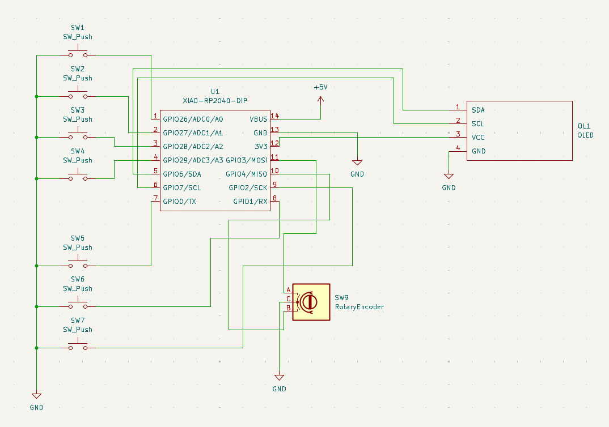
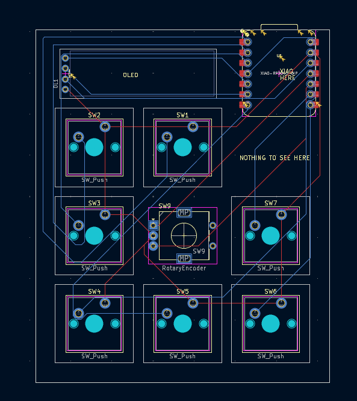
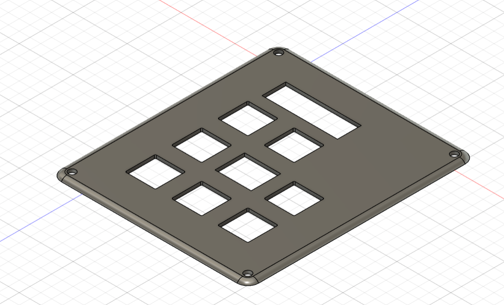
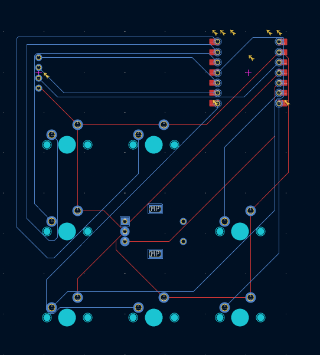

# CONTROLA

Controla is a compact, tactile controller that brings your most-used shortcuts and actions within reach. It pairs responsive physical controls with a crisp OLED for clear status and feedback, so you always know what layer or mode you’re in. Perfect for switching tools, controlling media, or speeding up repetitive tasks, Controla fits neatly beside your keyboard and adapts to your workflow.

## Features
- RP2040-based Seeed XIAO module
- 0.91" SSD1306 I2C OLED display
- Rotary encoder with push
- 7x MX-style mechanical switches with per-key RGB (SK6812 MINI-E)
- Custom PCB and 3D printed case

## Screenshots

- **Schematic:**
    

- **PCB:**
	
    

- **CAD:**
    
	

## Bill of Materials (BOM)

| Ref | Qty | Part | Description |
|---|---:|---|---|
| U1 | 1 | Seeed XIAO RP2040 (SMD) | RP2040 MCU module, SMD mount |
| OLED1 | 1 | 0.91" OLED SSD1306 I2C | Pin order GND-VCC-SCL-SDA |
| ENC1 | 1 | EC11 Rotary Encoder w/ push | Volume / scroll encoder |
| KNOB1 | 1 | Encoder knob | Fits EC11 shaft |
| SW1-SW7 | 7 | MX-style mechanical switches | Keyboard switches |
| KEYCAPS | 7 | Blank DSA keycaps (white) | For MX switches |
| LED1-LED7 | 7 | SK6812 MINI-E RGB LEDs | Per-key RGB lighting |
| D1-D7 | 7 | 1N4148 diodes (TH) | Optional, for key matrix |
| PCB1 | 1 | Custom PCB | Macropad PCB |
| M3x16 | 4 | M3 x 16mm screws | Case mounting |
| HEATSET | 4 | M3 heatset inserts | For 3D printed case |
| CASE | 1 | 3D printed case | No acrylic |
| SOLDER_IRON | 1 | Soldering iron | Required for assembly |
| SOLDER | 1 | Solder wire 0.5mm | For TH + SMD |
| FLUX | 1 | Flux pen | Recommended for SMD |

For the complete, raw BOM file see [BOM.csv](BOM.csv).

## Assembly
1. Solder the Seeed XIAO to the PCB (SMD pad/module) or mount per module instructions.
2. Solder the OLED to the I2C pads (GND, VCC, SCL, SDA).
3. Place and solder mechanical switches and diodes (if used) in the key matrix.
4. Solder SK6812 LEDs and route their data line according to PCB silkscreen.
5. Mount the rotary encoder and knob; secure with nuts if required.
6. Install M3 heatset inserts in the 3D-printed case, secure PCB with M3x16 screws.

## Firmware
Firmware and microcontroller code are in `Firmware/main.py`.

## Other files
- PCB and schematic files: [PCB/hackpad.kicad_pcb](PCB/hackpad.kicad_pcb)
- PCB project files and library: `PCB/` folder
- 3D models for case: `CAD/` folder

## License
This project is open-source. [Licnse](LICENSE)
